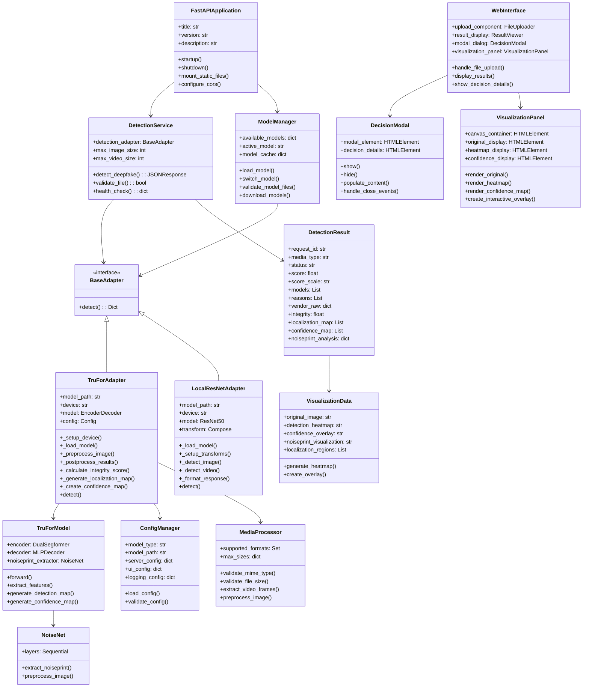

# Deepfake Detection System V2 - Domain Model Diagram

## System Overview
Version 2 introduces advanced TruFor model integration with pixel-level detection capabilities, enhanced UI with modal dialogs, and improved configuration management.

## Domain Model Diagram

## Key Domain Concepts

### 1. **Multi-Model Architecture**
- **TruForAdapter**: Advanced forensic model with pixel-level detection
- **LocalResNetAdapter**: Fast binary classification model
- **BaseAdapter**: Common interface ensuring consistency

### 2. **Enhanced Detection Results**
- **Integrity Score**: Overall authenticity assessment
- **Localization Maps**: Pixel-level manipulation detection
- **Confidence Maps**: Reliability assessment for each region
- **Noiseprint Analysis**: Digital fingerprint analysis

### 3. **Improved User Interface**
- **Decision Modal**: Centered modal with detailed analysis
- **Visualization Panel**: Multi-layer result display
- **Interactive Elements**: Hover effects and detailed breakdowns

### 4. **Configuration Management**
- **Model Selection**: Runtime model switching capability
- **Environment Configuration**: Flexible deployment options
- **Resource Management**: Memory and GPU optimization

### 5. **Media Processing Pipeline**
- **Format Validation**: Support for images and videos
- **Size Constraints**: Configurable file size limits
- **Preprocessing**: Standardized input preparation

## Version 2 Enhancements

1. **TruFor Integration**: State-of-the-art forensic analysis
2. **Pixel-Level Detection**: Precise manipulation localization
3. **Enhanced Visualization**: Multi-layer result presentation
4. **Improved UI**: Better modal positioning and user experience
5. **Configuration System**: Centralized settings management
6. **Model Management**: Dynamic model loading and switching
7. **Error Handling**: Comprehensive error recovery
8. **Internationalization**: English translation of all components
