# Deepfake Detection System V3.1 - Domain Model Diagram

## System Overview
Version 3.1 is a production-ready release with comprehensive bug fixes, enhanced security, and improved user experience. This version resolves 9 critical/medium bugs, implements stronger password policies, and optimizes mobile responsiveness.

## Domain Model Diagram

```mermaid
classDiagram
    class FastAPIApplication {
        +title: str
        +version: str
        +description: str
        +lifespan_context: AsyncContextManager
        +startup()
        +shutdown()
        +mount_static_files()
        +configure_cors()
        +setup_middleware()
    }

    class AuthenticationService {
        +secret_key: str
        +algorithm: str
        +token_expire_hours: int
        +register_user(username, password): dict
        +authenticate_user(username, password): dict
        +create_access_token(data): str
        +verify_token(token): dict
        +hash_password(password): str
        +verify_password(plain, hashed): bool
        +validate_password_policy(password): bool
    }

    class UserManager {
        +users_file: str
        +revoked_tokens_file: str
        +load_users(): dict
        +save_users(users): void
        +create_user(username, password): bool
        +get_user(username): dict
        +revoke_token(token): void
        +is_token_revoked(token): bool
    }

    class DetectionService {
        +trufor_adapter: TruForAdapter
        +deepfakebench_adapter: DeepfakeBenchAdapter
        +max_image_size: int
        +max_video_size: int
        +detect_image(file, user): JSONResponse
        +analyze_video(file, models, user): JSONResponse
        +validate_file(file): bool
        +validate_confidence(score): float
        +downsample_heatmap(array, max_size): array
        +health_check(): dict
    }

    class TruForAdapter {
        +model_path: str
        +device: str
        +model: EncoderDecoder
        +config: Config
        +max_output_size: int = 300
        +_setup_device()
        +_load_model()
        +_preprocess_image()
        +_postprocess_results()
        +_downsample_arrays(arrays, max_size)
        +_calculate_integrity_score()
        +_generate_localization_map()
        +_create_confidence_map()
        +detect(file_bytes): dict
    }

    class DeepfakeBenchAdapter {
        +models_root: str
        +available_models: list[12]
        +device: str
        +check_model_availability(): dict
        +analyze_video(file, model_keys, fps): dict
        +_extract_frames(video_path, fps): list
        +_run_frame_inference(frames, model): list
        +_aggregate_results(scores): dict
        +_generate_timeline(scores, threshold): list
        +_validate_scores(scores): list
    }

    class HistoryManager {
        +jobs_dir: str
        +sessions_dir: str
        +create_job(user, filename, type): str
        +update_job_status(job_id, status, result): void
        +get_user_jobs(user, filters): list
        +delete_job(job_id, user): bool
        +get_job_details(job_id, user): dict
        +sort_jobs_by_timestamp(jobs): list
    }

    class ReportGenerator {
        +pdf_generator: PDFGenerator
        +zip_generator: ZIPGenerator
        +generate_pdf(job_id): bytes
        +generate_zip(job_id): bytes
    }

    class PDFGenerator {
        +create_report(job_data): bytes
        +add_header(canvas, data): void
        +add_results_section(canvas, results): void
        +add_visualization(canvas, image_data): void
        +add_metadata(canvas, metadata): void
    }

    class ZIPGenerator {
        +create_archive(job_data): bytes
        +add_pdf_report(zip, job): void
        +add_results_json(zip, results): void
        +add_visualizations(zip, images): void
        +add_metadata(zip, meta): void
    }

    class ModelManager {
        +trufor_available: bool
        +deepfakebench_models: dict[12]
        +models_path: str = "models/"
        +load_trufor(): bool
        +load_deepfakebench_model(model_key): object
        +check_model_availability(): dict
        +validate_model_weights(): dict
    }

    class WebInterface {
        +login_page: HTML
        +register_page: HTML
        +main_page: HTML
        +history_page: HTML
        +deepfakebench_page: HTML
        +handle_authentication()
        +validate_token_client_side()
        +display_detection_results()
        +show_history()
        +render_mobile_view()
    }

    class MobileResponsiveUI {
        +breakpoint: int = 1024px
        +card_layout: CardComponent
        +table_layout: TableComponent
        +render_desktop(): void
        +render_mobile(): void
        +render_landscape(): void
        +toggle_view(): void
        +center_content_landscape(): void
    }

    class AuthDecorator {
        +get_current_user(token): dict
        +require_authentication(func): func
        +check_token_expiration(token): bool
    }

    class ConfigManager {
        +model_config: dict
        +server_config: dict
        +auth_config: dict
        +load_config(): dict
        +validate_config(): bool
        +get_model_path(model_name): str
    }

    class MediaProcessor {
        +supported_image_formats: Set
        +supported_video_formats: Set
        +max_canvas_pixels: int = 90000
        +validate_mime_type(file): bool
        +validate_file_size(file, max_size): bool
        +extract_video_frames(video_path, fps): list
        +preprocess_image(image): Tensor
        +limit_canvas_size(width, height): tuple
    }

    class DetectionResult {
        +job_id: str
        +user_id: str
        +filename: str
        +media_type: str
        +status: str
        +score: float
        +prediction: str
        +models_used: list
        +timestamp: datetime
        +results_data: dict
        +created_at: datetime
    }

    class CIManager {
        +workflows: list
        +test_coverage: float = 0.70
        +run_quality_checks(): bool
        +run_security_scan(): bool
        +run_unit_tests(): bool
        +build_docker_image(): bool
        +validate_configs(): bool
    }

    class ClientSideValidator {
        +validateToken(): bool
        +validatePasswordPolicy(password): bool
        +checkTokenExpiration(token): bool
        +redirectToLogin(): void
        +clearAuthData(): void
    }

    %% Relationships
    FastAPIApplication --> DetectionService
    FastAPIApplication --> AuthenticationService
    FastAPIApplication --> HistoryManager
    FastAPIApplication --> ModelManager
    
    DetectionService --> TruForAdapter
    DetectionService --> DeepfakeBenchAdapter
    DetectionService --> AuthDecorator
    DetectionService --> MediaProcessor
    
    AuthenticationService --> UserManager
    AuthenticationService --> AuthDecorator
    
    HistoryManager --> ReportGenerator
    ReportGenerator --> PDFGenerator
    ReportGenerator --> ZIPGenerator
    
    ModelManager --> TruForAdapter
    ModelManager --> DeepfakeBenchAdapter
    
    DetectionService --> DetectionResult
    DetectionResult --> HistoryManager
    
    WebInterface --> MobileResponsiveUI
    WebInterface --> AuthenticationService
    WebInterface --> ClientSideValidator
    
    FastAPIApplication --> ConfigManager
    ConfigManager --> ModelManager
    
    FastAPIApplication --> CIManager
```



## Key Domain Concepts

### 1. **Authentication & Authorization System** 🔐
- **JWT Token Management**: Secure token-based authentication with 24-hour expiration
- **User Manager**: User registration, login, and profile management
- **Enhanced Password Policy** ✨ (v3.1): 
  - Minimum 8 characters
  - At least one uppercase letter
  - At least one lowercase letter
  - At least one digit
  - Enforced on both frontend and backend
- **Token Revocation**: Blacklist for invalidated tokens
- **Client-Side Validation** ✨ (v3.1): Token validation before API calls
- **Protected Endpoints**: Authentication decorators for API routes

### 2. **Multi-Model Detection Architecture** 🤖
- **TruFor Adapter**: Pixel-level image forgery detection with optimized heatmap output
  - **Performance Optimization** ✨ (v3.1): Downsampling to 300x300 max for large images
  - Prevents browser crashes with large images (>1MB, >8192px)
- **DeepfakeBench Adapter**: 12 frame-level video detection models
  1. Xception
  2. MesoNet-4
  3. MesoNet-4 Inception
  4. F3Net
  5. EfficientNet-B4
  6. Capsule Net
  7. SRM
  8. RECCE
  9. SPSL
  10. UCF
  11. CNN-AUG
  12. CORE
- **Model Manager**: Centralized model path management (`models/` directory)
- **Confidence Validation** ✨ (v3.1): NaN and null checks for robust scoring

### 3. **History Management System** 📜
- **Job Tracking**: Persistent storage of detection jobs
- **Timestamp Sorting** ✨ (v3.1): Chronological ordering by `created_at`
- **Status Management**: Pending, Processing, Completed, Failed
- **User Isolation**: Each user can only access their own jobs
- **Filtering**: Filter by status, date, media type
- **Deletion**: Remove old detection records

### 4. **Report Generation** 📄
- **PDF Reports**: Comprehensive detection analysis reports
  - Executive summary
  - Detection results with validated confidence scores
  - Downsampled visualization heatmaps
  - Technical metadata
- **ZIP Archives**: Complete result packages
  - PDF report
  - Results JSON
  - Processed images/frames
  - Analysis metadata

### 5. **Mobile-Responsive UI** 📱
- **Responsive Breakpoint** ✨ (v3.1): 1024px width (increased from 768px)
- **Desktop Layout**: Table-based history view
- **Mobile Layout**: Card-based history view with improved centering
- **Landscape Support** ✨ (v3.1): Optimized landscape mode rendering
- **Adaptive Navigation**: Hamburger menu for mobile
- **Touch-Optimized**: Larger touch targets for mobile devices
- **Consistent Styling** ✨ (v3.1): Unified navbar padding (8px) across all pages
- **Table Scrolling** ✨ (v3.1): Horizontal scroll for tables on mobile

### 6. **CI/CD Pipeline** 🔄
- **Code Quality**: flake8, black, isort checks (all passing)
- **Security Scanning**: Trivy vulnerability detection
- **Unit Tests**: 67 automated tests (100% pass rate)
- **Test Coverage**: 70%+ (target: ≥60%)
- **Docker Build**: Automated image building
- **Configuration Validation**: YAML/JSON syntax checks

### 7. **Media Processing Pipeline** 🎬
- **Image Support**: JPEG, PNG (max 10MB)
- **Video Support**: MP4, MOV, AVI (max 100MB)
- **Canvas Optimization** ✨ (v3.1): Max 300x300px (90K pixels) for heatmaps
- **Frame Extraction**: Configurable FPS sampling
- **Format Validation**: MIME type checking
- **Size Limits**: Configurable per media type
- **Memory Safety**: Prevents browser crashes with large files

### 8. **Detection Result Structure** 📊
```json
{
  "job_id": "uuid",
  "user_id": "username",
  "filename": "sample.jpg",
  "media_type": "image",
  "status": "completed",
  "score": 0.85,
  "confidence": 0.85,
  "prediction": "fake",
  "models_used": ["trufor"],
  "timestamp": "2025-11-04T10:30:00Z",
  "created_at": "2025-11-04T10:30:00Z",
  "results_data": {
    "integrity_score": 0.15,
    "localization_map": [...],
    "confidence_map": [...],
    "image_size": [300, 300],
    "metadata": {...}
  }
}
```

## V3.1 Enhancements Over V3.0

### Bug Fixes 🐛
1. **BUG-007** 🔴 Critical: Large image browser crashes
   - Backend downsampling to 300x300 max
   - Frontend canvas pixel limits (90K pixels)
   - Can now handle images up to 8192x6554 pixels
   
2. **BUG-009** 🟡 Medium: NaN% confidence display
   - Added null and NaN validation
   - Displays "0%" and "Inconclusive" for invalid data
   
3. **BUG-010** 🔴 Critical: Invalid token redirect failure
   - Client-side token validation before API calls
   - Automatic redirect to login for expired tokens
   
4. **BUG-011** 🟢 Low: F12 DevTools layout corruption
   - CSS adjustments for stable column layout
   - `white-space: nowrap` and `min-width` fixes
   
5. **BUG-012** 🟡 Medium: Missing registration link
   - Added "Don't have an account? Register here" link
   - Improved UX for new users
   
6. **BUG-013** 🟢 Low: Inconsistent navigation bar
   - Unified navbar padding (8px) across all pages
   - Consistent visual appearance
   
7. **BUG-014** 🟡 Medium: History sorting inconsistency
   - Sort by `created_at` timestamp (newest first)
   - Predictable chronological order
   
8. **BUG-015** 🟡 Medium: Mobile responsive issues
   - Breakpoint increased to 1024px
   - Landscape mode centering
   - Table horizontal scrolling
   - Full navbar coverage on mobile

### Security Enhancements 🔒
1. **Enhanced Password Policy**:
   - Minimum 8 characters (up from basic length check)
   - Requires uppercase letter
   - Requires lowercase letter
   - Requires digit
   - Enforced on both client and server
   
2. **Client-Side Token Validation**:
   - Pre-flight token checks
   - Automatic session cleanup
   - Reduced unauthorized API calls

### Code Quality Improvements ✨
- Removed 8 unused/redundant code items
- Optimized imports across all modules
- Eliminated duplicate CSS declarations
- Translated all Chinese comments to English
- CI/CD pipeline fully passing (67/67 tests)

### Documentation & Organization 📚
- Reorganized LICENSE to `docs/handover/`
- Streamlined README.md (-35% content)
- Removed redundant CLI documentation
- Centralized model weights in `models/` directory
- Standardized changelog format (Keep a Changelog)

### Performance Optimizations ⚡
1. **Memory Management**:
   - Heatmap downsampling reduces network payload by ~95%
   - Frontend canvas limits prevent memory exhaustion
   - Handles 8K images without browser crashes

2. **Responsive Design**:
   - Optimized breakpoint (1024px) covers more devices
   - Landscape mode properly centered
   - Reduced layout shifts

## Data Flow

### Image Detection Flow (v3.1)
```
User → Login → Upload Image → Client Token Check →
TruFor Detection → Downsample Heatmaps (300x300) →
Validate Confidence → Save Results → History Storage → 
Generate Reports → Display Results (Limited Canvas Size)
```

### Video Detection Flow (v3.1)
```
User → Login → Upload Video → Select Models → Client Token Check →
Extract Frames → DeepfakeBench Analysis (12 models) →
Aggregate Scores → Validate Results → Generate Timeline →
Save Results → History Storage (sorted by timestamp) →
Generate Reports → Display Results with Keyframes
```

### History Access Flow (v3.1)
```
User → Login → Client Token Check → Request History →
Server Authentication → Fetch User Jobs → Sort by created_at →
Apply Filters → Render View (Desktop 1024px+/Mobile <1024px) →
Download Reports (PDF/ZIP) → Delete Jobs (Optional)
```

## Performance Considerations

1. **Caching**: Model weights loaded once and reused
2. **Lazy Loading**: Models loaded only when needed
3. **Connection Pooling**: Efficient database connections
4. **Async I/O**: Non-blocking file operations
5. **Memory Management**: 
   - Automatic cleanup of temporary files
   - Heatmap downsampling (v3.1)
   - Canvas size limits (v3.1)
6. **GPU Optimization**: CUDA support for faster inference

## Deployment Architecture

```
User Browser (Desktop/Mobile)
    ↓
FastAPI Server (Port 8000)
    ↓
├── TruFor Model (GPU/CPU) - Downsampled output
├── DeepfakeBench Models (12 models, GPU/CPU)
├── User Database (JSON) - Enhanced password validation
├── Job Storage (File System) - Sorted by timestamp
├── Model Weights (models/ directory)
└── Static Files (HTML/CSS/JS) - Responsive (1024px breakpoint)
```

## Version History

| Version | Date | Key Features |
|---------|------|--------------|
| V1.0 | Aug 2025 | Basic detection with single model |
| V2.0 | Sep 2025 | TruFor integration, Modal UI, JWT Auth |
| V3.0 | Oct 2025 | DeepfakeBench (12 models), History, Mobile UI, CI/CD |
| **V3.1** | **Nov 2025** | **9 bug fixes, enhanced security, optimized performance** |

---

**Document Version**: 3.1  
**Last Updated**: November 5, 2025  
**Author**: Xiyu Guan


