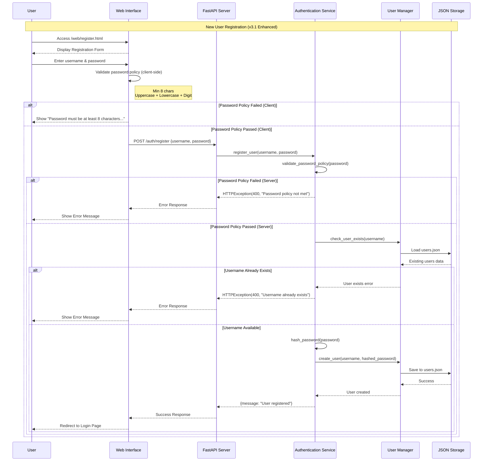
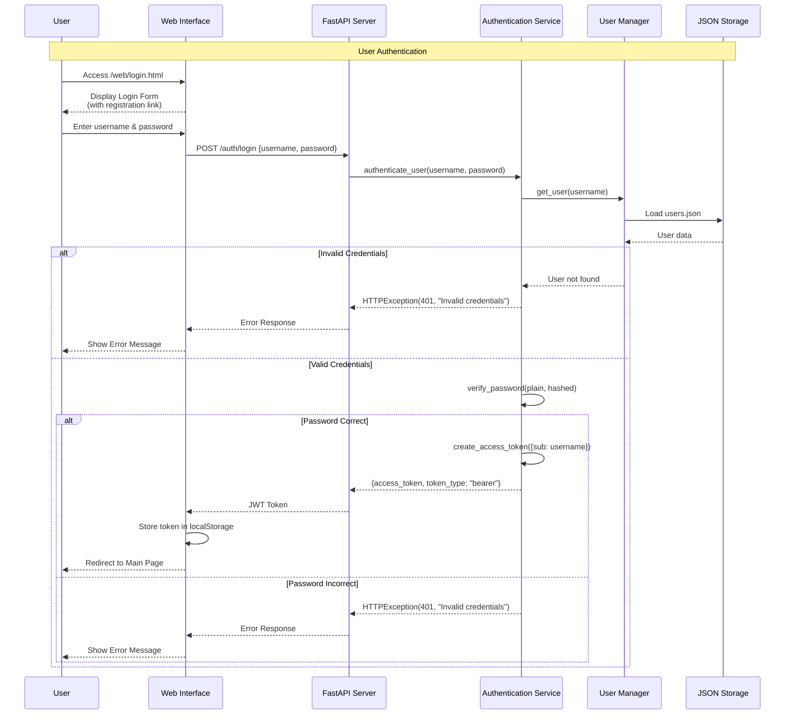
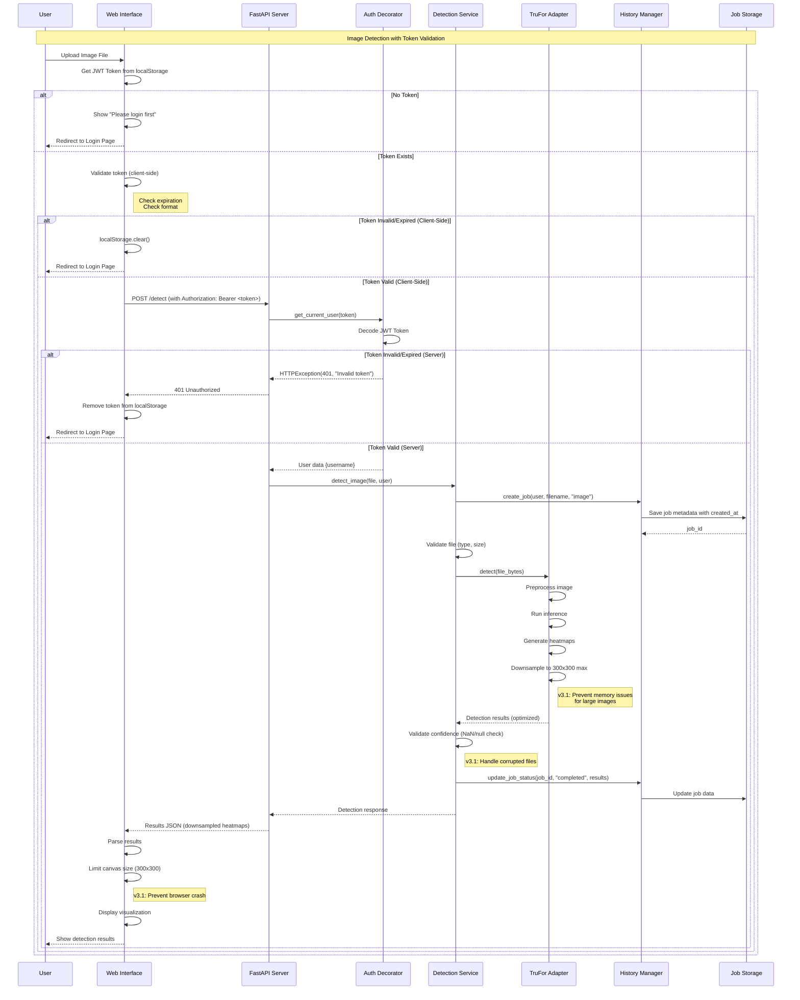
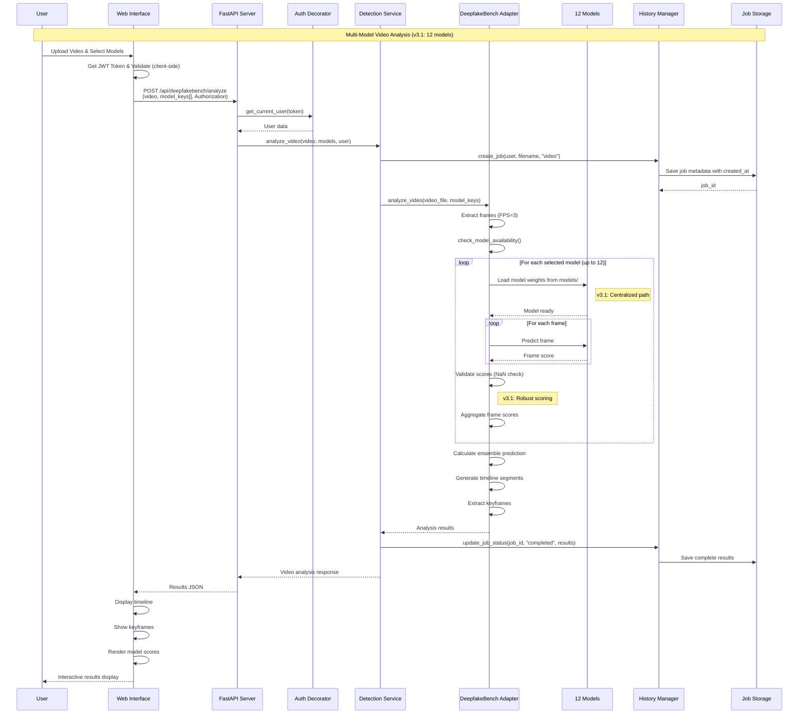
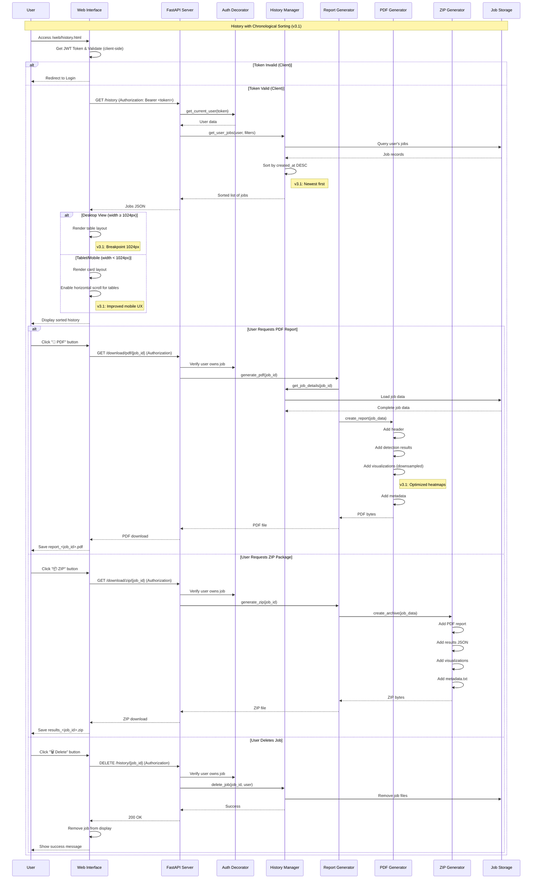
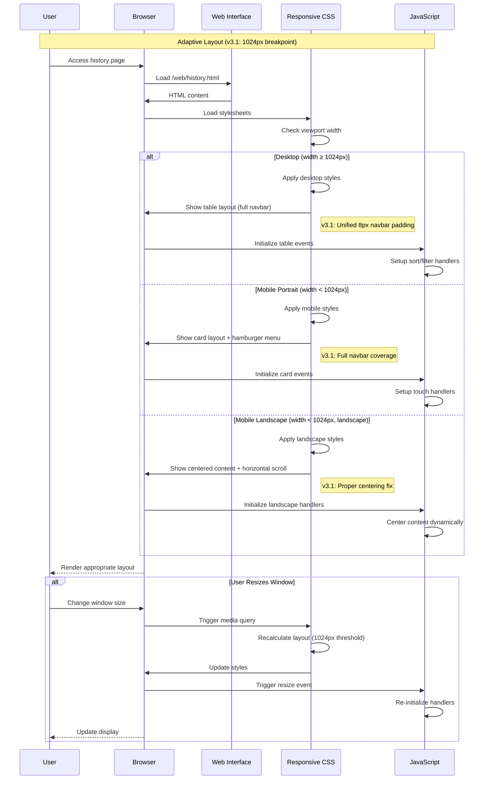
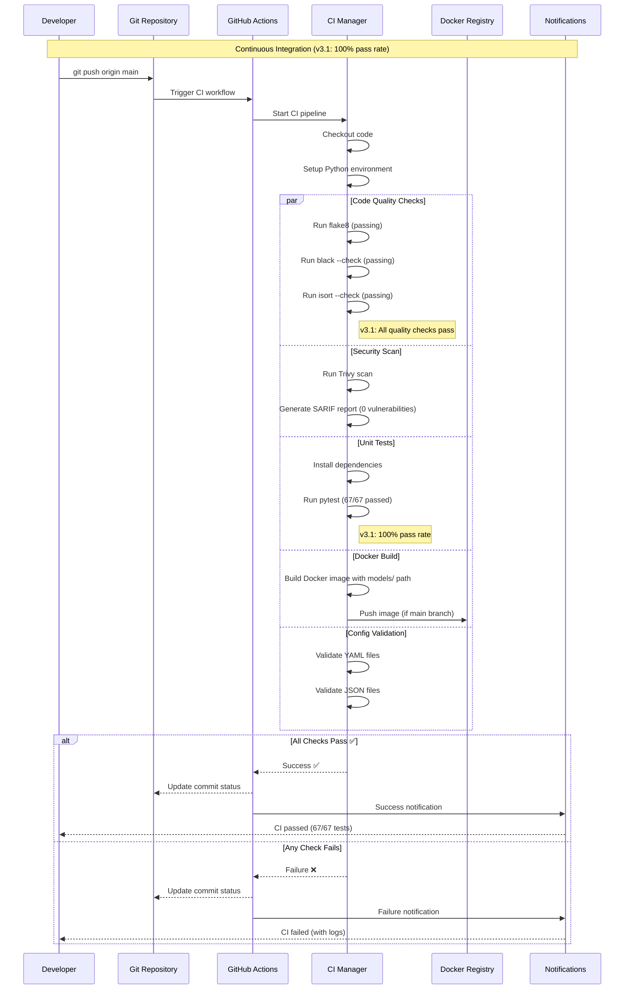
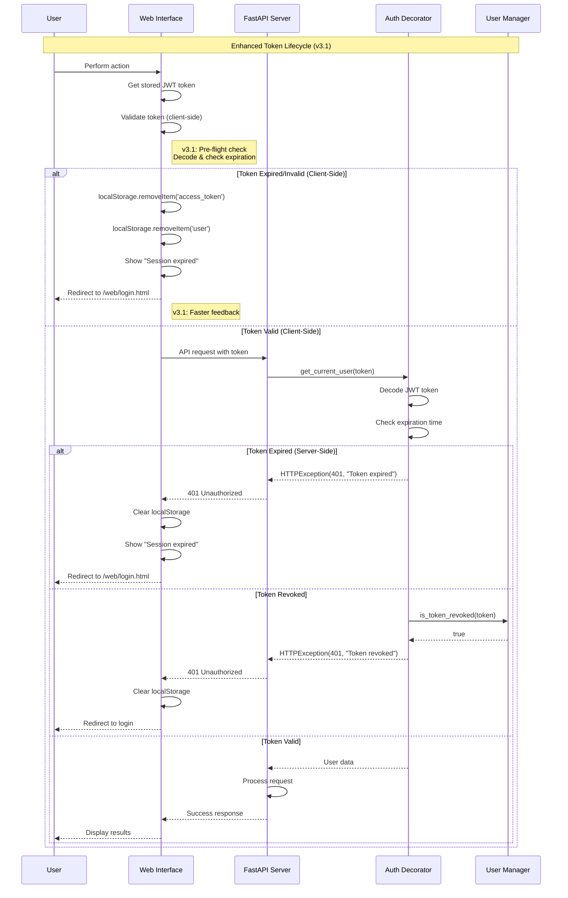

# Deepfake Detection System V3.1 - Sequence Diagram

## System Interaction Flow

### 1. User Registration with Enhanced Password Policy Sequence

### 2. User Login Sequence

### 3. Image Detection with Client-Side Token Validation (v3.1 Enhanced)

### 4. Video Detection with DeepfakeBench (12 Models) Sequence

### 5. History Access with Improved Sorting Sequence (v3.1 Enhanced)

### 6. Mobile Responsive Rendering with Enhanced Breakpoint (v3.1)

### 7. CI/CD Pipeline Sequence

### 8. Token Expiration and Client-Side Validation (v3.1 Enhanced)

## Key Sequence Patterns (v3.1 Updates)

### 1. **Authentication Flow**
- Enhanced password policy validation (client + server)
- Client-side token validation before API calls ✨
- Expired/invalid tokens redirect to login
- User data attached to request context
- Registration link on login page ✨

### 2. **Job Lifecycle**
1. Create job → Pending status (with `created_at` timestamp ✨)
2. Process detection → Processing status
3. Validate results → NaN/null checks ✨
4. Save results → Completed status (sorted by timestamp ✨)
5. Generate reports → Available for download (optimized heatmaps ✨)
6. Optional deletion → Remove from history

### 3. **Error Handling**
- HTTP 400: Bad request (validation errors, password policy ✨)
- HTTP 401: Unauthorized (auth failures, token validation ✨)
- HTTP 403: Forbidden (permission denied)
- HTTP 404: Not found (job doesn't exist)
- HTTP 500: Internal server error
- NaN/null confidence handling ✨

### 4. **Responsive Design (v3.1 Enhanced)**
- CSS media queries with 1024px breakpoint ✨
- JavaScript detects viewport and orientation
- Desktop: Table layout (≥1024px)
- Mobile: Card layout + hamburger menu (<1024px)
- Landscape: Centered content with horizontal scroll ✨
- Touch events for mobile interactions
- Resize handlers for live adaptation
- Unified navbar padding (8px) ✨

### 5. **Model Processing**
- TruFor: Single model, pixel-level analysis, downsampled output (300x300) ✨
- DeepfakeBench: 12 models ✨, frame-level analysis
- Confidence validation (NaN/null checks) ✨
- Results aggregation for ensemble predictions
- Timeline generation for video analysis
- Centralized model path (`models/` directory) ✨

## Performance Optimizations (v3.1)

1. **Async Operations**: All I/O operations non-blocking
2. **Lazy Loading**: Models loaded only when needed
3. **Caching**: Model weights persist across requests
4. **Connection Pooling**: Efficient resource management
5. **Batch Processing**: Multiple frames processed together
6. **Progressive Rendering**: UI updates as results arrive
7. **Heatmap Downsampling** ✨: 300x300 max, reduces payload by ~95%
8. **Canvas Size Limits** ✨: 90K pixels max, prevents browser crashes
9. **Client-Side Validation** ✨: Reduces unnecessary API calls

## Security Considerations (v3.1 Enhanced)

1. **Token Validation**: Client-side + server-side checks ✨
2. **Enhanced Password Policy** ✨: 8+ chars, uppercase, lowercase, digit
3. **User Isolation**: Jobs scoped to user
4. **Input Sanitization**: File validation before processing
5. **Rate Limiting**: Protection against abuse
6. **Secure Storage**: Passwords hashed with bcrypt
7. **CORS**: Controlled cross-origin access
8. **Confidence Validation** ✨: NaN/null checks prevent injection

---

**Document Version**: 3.1  
**Last Updated**: November 5, 2025  
**Author**: Xiyu Guan

