# Deepfake Detection System V3.1 - Sequence Diagram

## System Interaction Flow

### 1. User Registration with Enhanced Password Policy Sequence

### 2. User Login Sequence

### 3. Image Detection with Client-Side Token Validation (v3.1 Enhanced)

### 4. Video Detection with DeepfakeBench (12 Models) Sequence

### 5. History Access with Improved Sorting Sequence (v3.1 Enhanced)

```mermaid
sequenceDiagram
    participant User
    participant WebUI as Web Interface
    participant FastAPI as FastAPI Server
    participant AuthDec as Auth Decorator
    participant HistMgr as History Manager
    participant ReportGen as Report Generator
    participant PDFGen as PDF Generator
    participant ZIPGen as ZIP Generator
    participant Storage as Job Storage

    Note over User,Storage: History with Chronological Sorting (v3.1)

    User->>WebUI: Access /web/history.html
    WebUI->>WebUI: Get JWT Token & Validate (client-side)
    
    alt Token Invalid (Client)
        WebUI-->>User: Redirect to Login
    else Token Valid (Client)
        WebUI->>FastAPI: GET /history (Authorization: Bearer <token>)
        
        FastAPI->>AuthDec: get_current_user(token)
        AuthDec-->>FastAPI: User data
        
        FastAPI->>HistMgr: get_user_jobs(user, filters)
        HistMgr->>Storage: Query user's jobs
        Storage-->>HistMgr: Job records
        HistMgr->>HistMgr: Sort by created_at DESC
        Note right of HistMgr: v3.1: Newest first
        HistMgr-->>FastAPI: Sorted list of jobs
        FastAPI-->>WebUI: Jobs JSON
        
        alt Desktop View (width ≥ 1024px)
            WebUI->>WebUI: Render table layout
            Note right of WebUI: v3.1: Breakpoint 1024px
        else Tablet/Mobile (width < 1024px)
            WebUI->>WebUI: Render card layout
            WebUI->>WebUI: Enable horizontal scroll for tables
            Note right of WebUI: v3.1: Improved mobile UX
        end
        
        WebUI-->>User: Display sorted history
        
        alt User Requests PDF Report
            User->>WebUI: Click "📄 PDF" button
            WebUI->>FastAPI: GET /download/pdf/{job_id} (Authorization)
            
            FastAPI->>AuthDec: Verify user owns job
            FastAPI->>ReportGen: generate_pdf(job_id)
            
            ReportGen->>HistMgr: get_job_details(job_id)
            HistMgr->>Storage: Load job data
            Storage-->>HistMgr: Complete job data
            
            ReportGen->>PDFGen: create_report(job_data)
            PDFGen->>PDFGen: Add header
            PDFGen->>PDFGen: Add detection results
            PDFGen->>PDFGen: Add visualizations (downsampled)
            Note right of PDFGen: v3.1: Optimized heatmaps
            PDFGen->>PDFGen: Add metadata
            PDFGen-->>ReportGen: PDF bytes
            
            ReportGen-->>FastAPI: PDF file
            FastAPI-->>WebUI: PDF download
            WebUI-->>User: Save report_<job_id>.pdf
        
        else User Requests ZIP Package
            User->>WebUI: Click "📦 ZIP" button
            WebUI->>FastAPI: GET /download/zip/{job_id} (Authorization)
            
            FastAPI->>AuthDec: Verify user owns job
            FastAPI->>ReportGen: generate_zip(job_id)
            
            ReportGen->>ZIPGen: create_archive(job_data)
            ZIPGen->>ZIPGen: Add PDF report
            ZIPGen->>ZIPGen: Add results JSON
            ZIPGen->>ZIPGen: Add visualizations
            ZIPGen->>ZIPGen: Add metadata.txt
            ZIPGen-->>ReportGen: ZIP bytes
            
            ReportGen-->>FastAPI: ZIP file
            FastAPI-->>WebUI: ZIP download
            WebUI-->>User: Save results_<job_id>.zip
        
        else User Deletes Job
            User->>WebUI: Click "🗑️ Delete" button
            WebUI->>FastAPI: DELETE /history/{job_id} (Authorization)
            
            FastAPI->>AuthDec: Verify user owns job
            FastAPI->>HistMgr: delete_job(job_id, user)
            HistMgr->>Storage: Remove job files
            HistMgr-->>FastAPI: Success
            FastAPI-->>WebUI: 200 OK
            WebUI->>WebUI: Remove job from display
            WebUI-->>User: Show success message
        end
    end
```

### 6. Mobile Responsive Rendering with Enhanced Breakpoint (v3.1)

```mermaid
sequenceDiagram
    participant User
    participant Browser as Browser
    participant WebUI as Web Interface
    participant CSS as Responsive CSS
    participant JS as JavaScript

    Note over User,JS: Adaptive Layout (v3.1: 1024px breakpoint)

    User->>Browser: Access history page
    Browser->>WebUI: Load /web/history.html
    WebUI->>Browser: HTML content
    
    Browser->>CSS: Load stylesheets
    CSS->>CSS: Check viewport width
    
    alt Desktop (width ≥ 1024px)
        CSS->>CSS: Apply desktop styles
        CSS->>Browser: Show table layout (full navbar)
        Note right of CSS: v3.1: Unified 8px navbar padding
        Browser->>JS: Initialize table events
        JS->>JS: Setup sort/filter handlers
    else Mobile Portrait (width < 1024px)
        CSS->>CSS: Apply mobile styles
        CSS->>Browser: Show card layout + hamburger menu
        Note right of CSS: v3.1: Full navbar coverage
        Browser->>JS: Initialize card events
        JS->>JS: Setup touch handlers
    else Mobile Landscape (width < 1024px, landscape)
        CSS->>CSS: Apply landscape styles
        CSS->>Browser: Show centered content + horizontal scroll
        Note right of CSS: v3.1: Proper centering fix
        Browser->>JS: Initialize landscape handlers
        JS->>JS: Center content dynamically
    end
    
    Browser-->>User: Render appropriate layout
    
    alt User Resizes Window
        User->>Browser: Change window size
        Browser->>CSS: Trigger media query
        CSS->>CSS: Recalculate layout (1024px threshold)
        CSS->>Browser: Update styles
        Browser->>JS: Trigger resize event
        JS->>JS: Re-initialize handlers
        Browser-->>User: Update display
    end
```

### 7. CI/CD Pipeline Sequence

### 8. Token Expiration and Client-Side Validation (v3.1 Enhanced)

## Key Sequence Patterns (v3.1 Updates)

### 1. **Authentication Flow**
- Enhanced password policy validation (client + server)
- Client-side token validation before API calls ✨
- Expired/invalid tokens redirect to login
- User data attached to request context
- Registration link on login page ✨

### 2. **Job Lifecycle**
1. Create job → Pending status (with `created_at` timestamp ✨)
2. Process detection → Processing status
3. Validate results → NaN/null checks ✨
4. Save results → Completed status (sorted by timestamp ✨)
5. Generate reports → Available for download (optimized heatmaps ✨)
6. Optional deletion → Remove from history

### 3. **Error Handling**
- HTTP 400: Bad request (validation errors, password policy ✨)
- HTTP 401: Unauthorized (auth failures, token validation ✨)
- HTTP 403: Forbidden (permission denied)
- HTTP 404: Not found (job doesn't exist)
- HTTP 500: Internal server error
- NaN/null confidence handling ✨

### 4. **Responsive Design (v3.1 Enhanced)**
- CSS media queries with 1024px breakpoint ✨
- JavaScript detects viewport and orientation
- Desktop: Table layout (≥1024px)
- Mobile: Card layout + hamburger menu (<1024px)
- Landscape: Centered content with horizontal scroll ✨
- Touch events for mobile interactions
- Resize handlers for live adaptation
- Unified navbar padding (8px) ✨

### 5. **Model Processing**
- TruFor: Single model, pixel-level analysis, downsampled output (300x300) ✨
- DeepfakeBench: 12 models ✨, frame-level analysis
- Confidence validation (NaN/null checks) ✨
- Results aggregation for ensemble predictions
- Timeline generation for video analysis
- Centralized model path (`models/` directory) ✨

## Performance Optimizations (v3.1)

1. **Async Operations**: All I/O operations non-blocking
2. **Lazy Loading**: Models loaded only when needed
3. **Caching**: Model weights persist across requests
4. **Connection Pooling**: Efficient resource management
5. **Batch Processing**: Multiple frames processed together
6. **Progressive Rendering**: UI updates as results arrive
7. **Heatmap Downsampling** ✨: 300x300 max, reduces payload by ~95%
8. **Canvas Size Limits** ✨: 90K pixels max, prevents browser crashes
9. **Client-Side Validation** ✨: Reduces unnecessary API calls

## Security Considerations (v3.1 Enhanced)

1. **Token Validation**: Client-side + server-side checks ✨
2. **Enhanced Password Policy** ✨: 8+ chars, uppercase, lowercase, digit
3. **User Isolation**: Jobs scoped to user
4. **Input Sanitization**: File validation before processing
5. **Rate Limiting**: Protection against abuse
6. **Secure Storage**: Passwords hashed with bcrypt
7. **CORS**: Controlled cross-origin access
8. **Confidence Validation** ✨: NaN/null checks prevent injection

---

**Document Version**: 3.1  
**Last Updated**: November 5, 2025  
**Author**: Xiyu Guan

