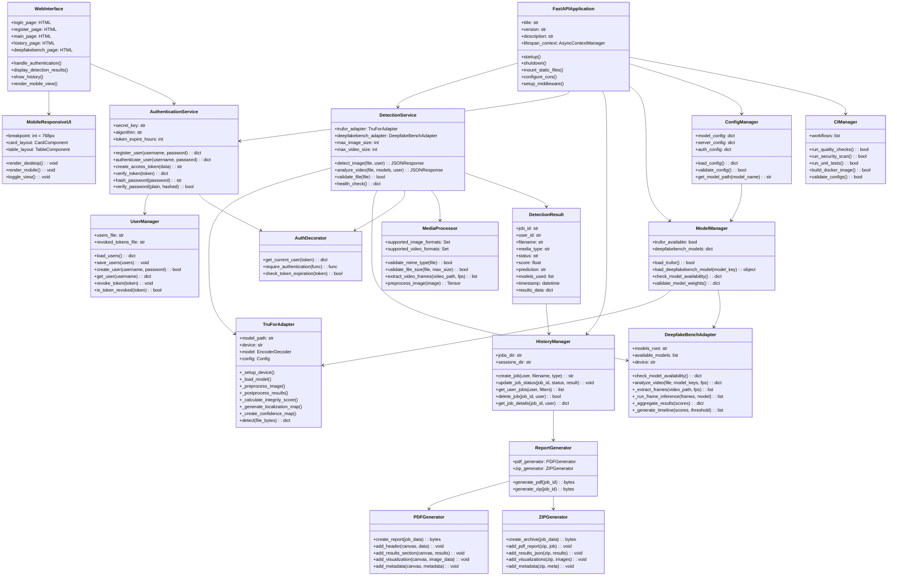

# Deepfake Detection System V3 - Domain Model Diagram

## System Overview
Version 3 represents the production-ready system with complete authentication, history management, DeepfakeBench integration (13 models), mobile-responsive UI, and CI/CD pipeline.

## Domain Model Diagram



## Key Domain Concepts

### 1. **Authentication & Authorization System** 🔐
- **JWT Token Management**: Secure token-based authentication
- **User Manager**: User registration, login, and profile management
- **Token Expiration**: 24-hour token lifecycle
- **Revocation List**: Blacklist for invalidated tokens
- **Protected Endpoints**: Authentication decorators for API routes

### 2. **Multi-Model Detection Architecture** 🤖
- **TruFor Adapter**: Pixel-level image forgery detection
- **DeepfakeBench Adapter**: 12 frame-level video detection models
  1. Xception
  2. MesoNet-4
  3. MesoNet-4 Inception
  4. F3Net
  5. EfficientNet-B4
  6. Capsule Net
  7. SRM
  8. RECCE
  9. SPSL
  10. UCF
  11. CNN-AUG
  12. CORE
- **Model Manager**: Availability checking and model loading

### 3. **History Management System** 📜
- **Job Tracking**: Persistent storage of detection jobs
- **Status Management**: Pending, Processing, Completed, Failed
- **User Isolation**: Each user can only access their own jobs
- **Filtering**: Filter by status, date, media type
- **Deletion**: Remove old detection records

### 4. **Report Generation** 📄
- **PDF Reports**: Comprehensive detection analysis reports
  - Executive summary
  - Detection results with confidence scores
  - Visualization heatmaps
  - Technical metadata
- **ZIP Archives**: Complete result packages
  - PDF report
  - Results JSON
  - Processed images/frames
  - Analysis metadata

### 5. **Mobile-Responsive UI** 📱
- **Responsive Breakpoint**: 768px width
- **Desktop Layout**: Table-based history view
- **Mobile Layout**: Card-based history view
- **Adaptive Navigation**: Hamburger menu for mobile
- **Touch-Optimized**: Larger touch targets for mobile devices

### 6. **CI/CD Pipeline** 🔄
- **Code Quality**: flake8, black, isort checks
- **Security Scanning**: Trivy vulnerability detection
- **Unit Tests**: pytest test suite execution
- **Docker Build**: Automated image building
- **Configuration Validation**: YAML/JSON syntax checks

### 7. **Media Processing Pipeline** 🎬
- **Image Support**: JPEG, PNG (max 10MB)
- **Video Support**: MP4, MOV, AVI (max 100MB)
- **Frame Extraction**: Configurable FPS sampling
- **Format Validation**: MIME type checking
- **Size Limits**: Configurable per media type

### 8. **Detection Result Structure** 📊
```json
{
  "job_id": "uuid",
  "user_id": "username",
  "filename": "sample.jpg",
  "media_type": "image",
  "status": "completed",
  "score": 0.85,
  "prediction": "fake",
  "models_used": ["trufor"],
  "timestamp": "2025-10-25T10:30:00Z",
  "results_data": {
    "integrity_score": 0.15,
    "localization_map": [...],
    "confidence_map": [...],
    "metadata": {...}
  }
}
```

## V3 Enhancements Over V2

### New Features ✨
1. **Complete Authentication System**
   - User registration and login
   - JWT token-based security
   - Protected API endpoints
   - Token expiration and revocation

2. **History Management**
   - Persistent job tracking
   - User-specific detection history
   - Report generation (PDF/ZIP)
   - Job status lifecycle management

3. **DeepfakeBench Integration**
   - 13 state-of-the-art models
   - Multi-model video analysis
   - Model availability checking
   - Ensemble prediction support

4. **Mobile-Responsive Design**
   - Responsive history page (card layout)
   - Mobile-optimized navigation
   - Touch-friendly interface
   - Adaptive breakpoints

5. **CI/CD Pipeline**
   - Automated quality checks
   - Security vulnerability scanning
   - Continuous testing
   - Docker build validation

6. **Enhanced Error Handling**
   - Structured error responses
   - Authentication error handling
   - User-friendly error messages
   - Comprehensive logging

### Architecture Improvements 🏗️
1. **Separation of Concerns**: Clear boundaries between services
2. **Dependency Injection**: Configurable components
3. **Async Processing**: Non-blocking operations
4. **Resource Management**: Automatic cleanup
5. **Scalability**: Support for concurrent users
6. **Maintainability**: Modular design with clear interfaces

### Security Enhancements 🔒
1. **Password Hashing**: bcrypt for secure storage
2. **JWT Tokens**: Stateless authentication
3. **CORS Configuration**: Controlled cross-origin access
4. **Input Validation**: Comprehensive file validation
5. **Token Revocation**: Blacklist for compromised tokens
6. **Rate Limiting**: Protection against abuse

## Data Flow

### Image Detection Flow
```
User → Login → Upload Image → Authentication Check → 
TruFor Detection → Save Results → History Storage → 
Generate Reports → Display Results
```

### Video Detection Flow
```
User → Login → Upload Video → Select Models → Authentication Check →
Extract Frames → DeepfakeBench Analysis → Aggregate Scores →
Generate Timeline → Save Results → History Storage →
Generate Reports → Display Results with Keyframes
```

### History Access Flow
```
User → Login → Request History → Authentication Check →
Fetch User Jobs → Apply Filters → Render View (Desktop/Mobile) →
Download Reports (PDF/ZIP) → Delete Jobs (Optional)
```

## Performance Considerations

1. **Caching**: Model weights loaded once and reused
2. **Lazy Loading**: Models loaded only when needed
3. **Connection Pooling**: Efficient database connections
4. **Async I/O**: Non-blocking file operations
5. **Memory Management**: Automatic cleanup of temporary files
6. **GPU Optimization**: CUDA support for faster inference

## Deployment Architecture

```
User Browser
    ↓
FastAPI Server (Port 8000)
    ↓
├── TruFor Model (GPU/CPU)
├── DeepfakeBench Models (GPU/CPU)
├── User Database (JSON)
├── Job Storage (File System)
└── Static Files (HTML/CSS/JS)
```

## Version History

| Version | Date | Key Features |
|---------|------|--------------|
| V1.0 | - | Basic detection with ResNet |
| V2.0 | Oct 2025 | TruFor integration, Modal UI |
| **V3.0** | **Oct 2025** | **Auth, History, DeepfakeBench (12 models), Mobile UI, CI/CD** |

---

**Document Version**: 3.0  
**Last Updated**: October 25, 2025  
**Author**: Xiyu Guan

