# Deepfake Detection System V3 - Sequence Diagram

## System Interaction Flow

### 1. User Registration Sequence

### 2. User Login Sequence

### 3. Image Detection with Authentication Sequence

### 4. Video Detection with DeepfakeBench Sequence

### 5. History Access and Report Generation Sequence

```mermaid
sequenceDiagram
    participant User
    participant WebUI as Web Interface
    participant FastAPI as FastAPI Server
    participant AuthDec as Auth Decorator
    participant HistMgr as History Manager
    participant ReportGen as Report Generator
    participant PDFGen as PDF Generator
    participant ZIPGen as ZIP Generator
    participant Storage as Job Storage

    Note over User,Storage: History Viewing and Report Download

    User->>WebUI: Access /web/history.html
    WebUI->>WebUI: Get JWT Token
    WebUI->>FastAPI: GET /history (Authorization: Bearer <token>)
    
    FastAPI->>AuthDec: get_current_user(token)
    AuthDec-->>FastAPI: User data
    
    FastAPI->>HistMgr: get_user_jobs(user, filters)
    HistMgr->>Storage: Query user's jobs
    Storage-->>HistMgr: Job records
    HistMgr-->>FastAPI: List of jobs
    FastAPI-->>WebUI: Jobs JSON
    
    alt Desktop View (width > 768px)
        WebUI->>WebUI: Render table layout
    else Mobile View (width ≤ 768px)
        WebUI->>WebUI: Render card layout
    end
    
    WebUI-->>User: Display history
    
    alt User Requests PDF Report
        User->>WebUI: Click "📄 PDF" button
        WebUI->>FastAPI: GET /download/pdf/{job_id} (Authorization)
        
        FastAPI->>AuthDec: Verify user owns job
        FastAPI->>ReportGen: generate_pdf(job_id)
        
        ReportGen->>HistMgr: get_job_details(job_id)
        HistMgr->>Storage: Load job data
        Storage-->>HistMgr: Complete job data
        
        ReportGen->>PDFGen: create_report(job_data)
        PDFGen->>PDFGen: Add header
        PDFGen->>PDFGen: Add detection results
        PDFGen->>PDFGen: Add visualizations
        PDFGen->>PDFGen: Add metadata
        PDFGen-->>ReportGen: PDF bytes
        
        ReportGen-->>FastAPI: PDF file
        FastAPI-->>WebUI: PDF download
        WebUI-->>User: Save report_<job_id>.pdf
    
    else User Requests ZIP Package
        User->>WebUI: Click "📦 ZIP" button
        WebUI->>FastAPI: GET /download/zip/{job_id} (Authorization)
        
        FastAPI->>AuthDec: Verify user owns job
        FastAPI->>ReportGen: generate_zip(job_id)
        
        ReportGen->>ZIPGen: create_archive(job_data)
        ZIPGen->>ZIPGen: Add PDF report
        ZIPGen->>ZIPGen: Add results JSON
        ZIPGen->>ZIPGen: Add visualizations
        ZIPGen->>ZIPGen: Add metadata.txt
        ZIPGen-->>ReportGen: ZIP bytes
        
        ReportGen-->>FastAPI: ZIP file
        FastAPI-->>WebUI: ZIP download
        WebUI-->>User: Save results_<job_id>.zip
    
    else User Deletes Job
        User->>WebUI: Click "🗑️ Delete" button
        WebUI->>FastAPI: DELETE /history/{job_id} (Authorization)
        
        FastAPI->>AuthDec: Verify user owns job
        FastAPI->>HistMgr: delete_job(job_id, user)
        HistMgr->>Storage: Remove job files
        HistMgr-->>FastAPI: Success
        FastAPI-->>WebUI: 200 OK
        WebUI->>WebUI: Remove job from display
        WebUI-->>User: Show success message
    end
```

### 6. Mobile Responsive Rendering Sequence

### 7. CI/CD Pipeline Sequence

### 8. Token Expiration Handling Sequence

## Key Sequence Patterns

### 1. **Authentication Flow**
- Every protected endpoint requires JWT token
- Token validation happens before business logic
- Expired/invalid tokens redirect to login
- User data attached to request context

### 2. **Job Lifecycle**
1. Create job → Pending status
2. Process detection → Processing status
3. Save results → Completed status
4. Generate reports → Available for download
5. Optional deletion → Remove from history

### 3. **Error Handling**
- HTTP 400: Bad request (validation errors)
- HTTP 401: Unauthorized (auth failures)
- HTTP 403: Forbidden (permission denied)
- HTTP 404: Not found (job doesn't exist)
- HTTP 500: Internal server error

### 4. **Responsive Design**
- CSS media queries detect viewport size
- JavaScript dynamically loads appropriate layout
- Touch events for mobile interactions
- Resize handlers for live adaptation

### 5. **Model Processing**
- TruFor: Single model, pixel-level analysis
- DeepfakeBench: Multi-model, frame-level analysis
- Results aggregation for ensemble predictions
- Timeline generation for video analysis

## Performance Optimizations

1. **Async Operations**: All I/O operations non-blocking
2. **Lazy Loading**: Models loaded only when needed
3. **Caching**: Model weights persist across requests
4. **Connection Pooling**: Efficient resource management
5. **Batch Processing**: Multiple frames processed together
6. **Progressive Rendering**: UI updates as results arrive

## Security Considerations

1. **Token Validation**: Every request verified
2. **User Isolation**: Jobs scoped to user
3. **Input Sanitization**: File validation before processing
4. **Rate Limiting**: Protection against abuse
5. **Secure Storage**: Passwords hashed with bcrypt
6. **CORS**: Controlled cross-origin access

---

**Document Version**: 3.0  
**Last Updated**: October 25, 2025  
**Author**: Xiyu Guan

