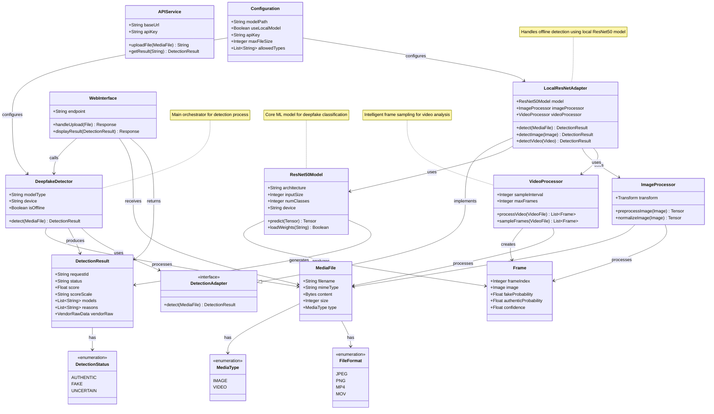

# Deepfake Detection System - Domain Model Diagram

## Key Components Description

### Core Entities
- **DeepfakeDetector**: Main orchestrator that coordinates the detection process
- **MediaFile**: Represents uploaded images or videos with metadata
- **DetectionResult**: Contains the analysis results and confidence scores

### Model Components
- **ResNet50Model**: The core machine learning model for classification
- **LocalResNetAdapter**: Adapter that implements offline detection using ResNet50
- **ImageProcessor**: Handles image preprocessing and normalization
- **VideoProcessor**: Manages video frame sampling and processing

### Processing Flow
1. **MediaFile** is uploaded through **WebInterface**
2. **DeepfakeDetector** receives the file and delegates to appropriate adapter
3. **LocalResNetAdapter** processes the file using **ResNet50Model**
4. For videos, **VideoProcessor** samples frames and processes each frame
5. **ImageProcessor** preprocesses each frame/image
6. **ResNet50Model** analyzes the processed data
7. Results are aggregated and returned as **DetectionResult**

### Security Features
- Complete offline operation (no external API calls)
- Local data processing only
- Configurable model paths and settings
- Support for multiple media formats
