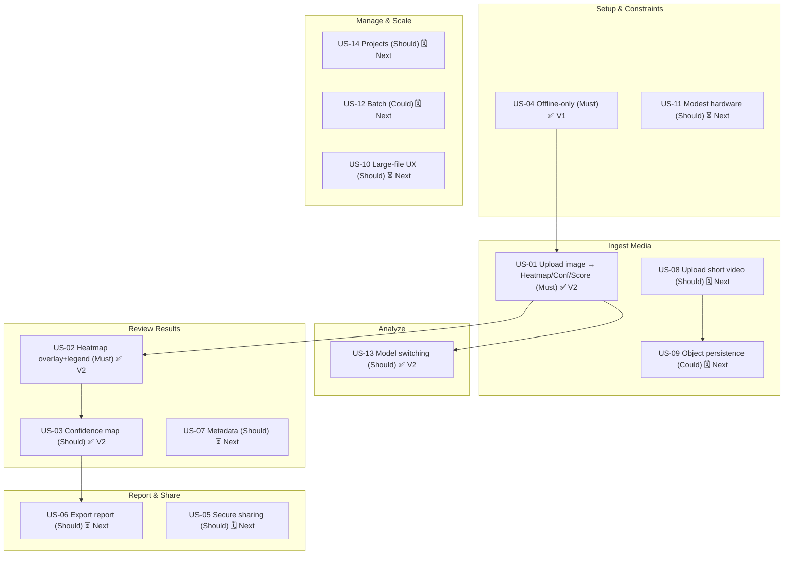

# User Story Map — Deepfake Investigation Tool
Generated: 2025-09-27 05:33

## Backbone (Activities)
1) Setup & Constraints → 2) Ingest Media → 3) Analyze → 4) Review Results → 5) Report & Share → 6) Manage & Scale

### Setup & Constraints
- **US-04** Offline-only (Must) — **V1 Done**
- **US-11** Modest hardware (Should) — Next

### Ingest Media
- **US-01** Upload image → Heatmap/Confidence/Score (Must) — **V2 Done**
- **US-08** Upload short video (Should) — Next
- **US-09** Object persistence checks (Could) — Next

### Analyze
- **US-13** Model switching (TruFor/ResNet) (Should) — **V2 Done**

### Review Results
- **US-02** Heatmap overlay + legend/threshold (Must) — **V2 Done**
- **US-03** Confidence map (Should) — **V2 Done**
- **US-07** Metadata view (Should) — In Progress (Next)

### Report & Share
- **US-06** Export report (Should) — In Progress (Next)
- **US-05** Secure sharing (Should) — Planned (Next)

### Manage & Scale
- **US-14** Project-scoped storage (Should) — Planned (Next)
- **US-12** Batch processing (Could) — Planned (Next)
- **US-10** Large-file UX (Should) — In Progress (Next)

## Mermaid View

