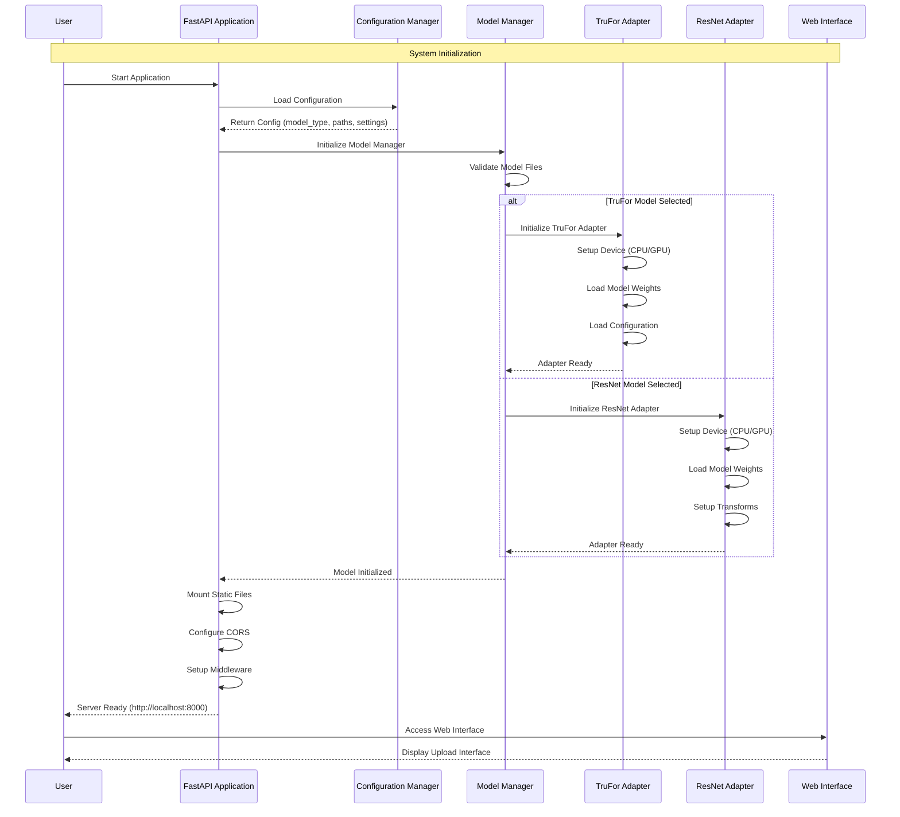
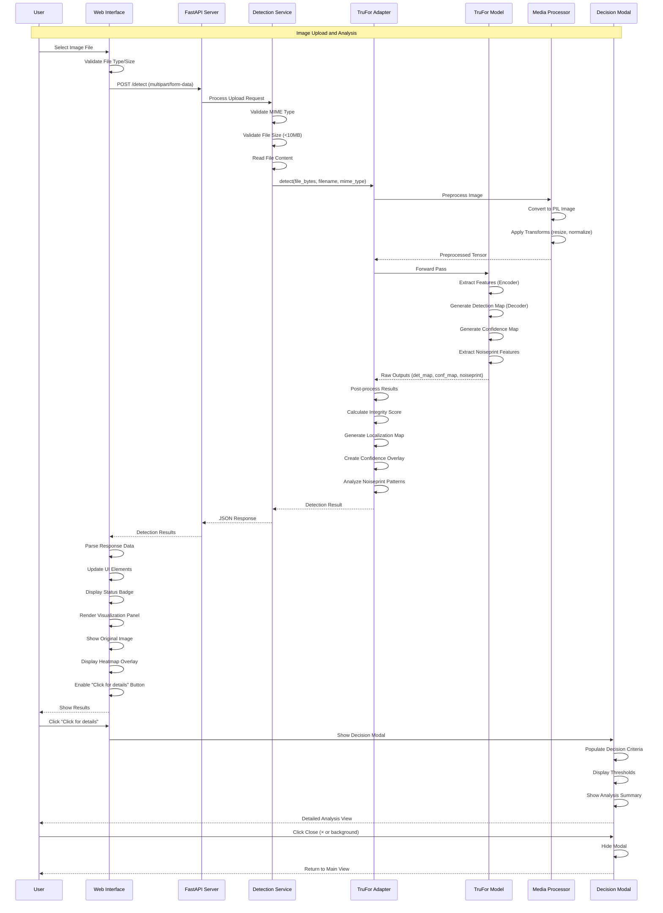
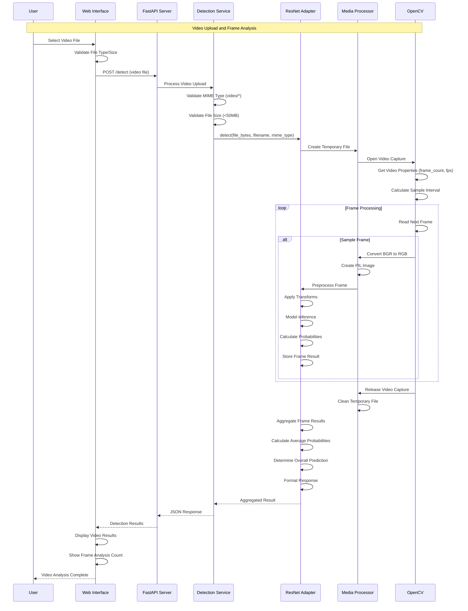
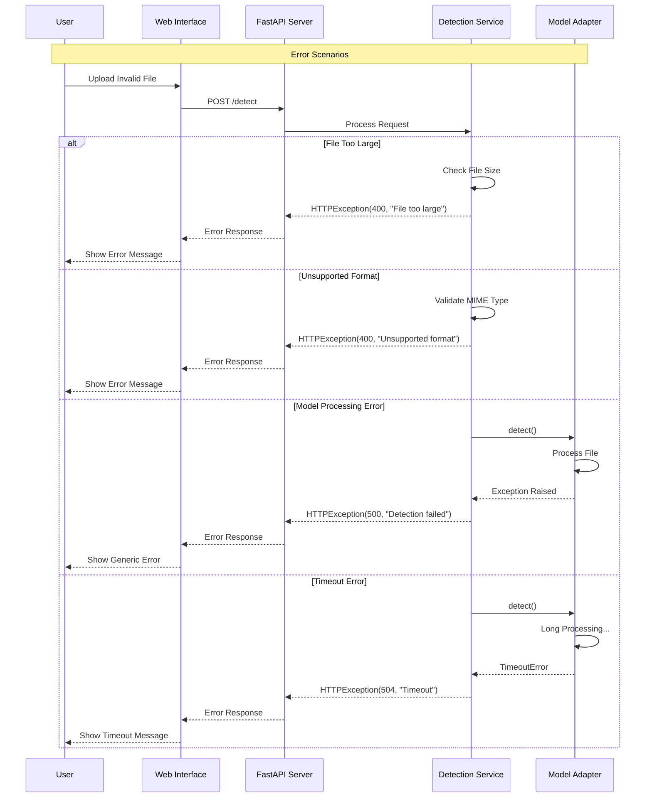
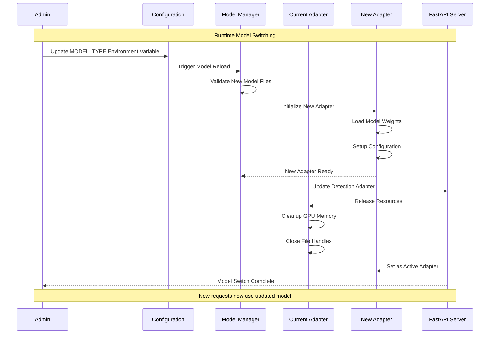

# Deepfake Detection System V2 - Sequence Diagram

## System Interaction Flow

### 1. Application Startup Sequence

### 2. Image Detection Sequence (TruFor Model)

### 3. Video Detection Sequence (ResNet Model)

### 4. Error Handling Sequence

### 5. Model Switching Sequence (Runtime)

## Key Sequence Patterns

### 1. **Async Processing**
- All detection operations are asynchronous
- Non-blocking file I/O operations
- Concurrent request handling

### 2. **Error Propagation**
- Structured error handling at each layer
- HTTP status codes for different error types
- User-friendly error messages

### 3. **Resource Management**
- Automatic cleanup of temporary files
- GPU memory management
- Connection pooling for concurrent requests

### 4. **UI Responsiveness**
- Progressive result display
- Modal dialog management
- Real-time status updates

### 5. **Model Abstraction**
- Consistent adapter interface
- Runtime model switching capability
- Fallback mechanisms for model failures

## Performance Considerations

1. **File Size Limits**: Prevent memory exhaustion
2. **Timeout Handling**: Avoid hanging requests
3. **Frame Sampling**: Efficient video processing
4. **Memory Cleanup**: Prevent resource leaks
5. **Caching**: Model weight persistence across requests
