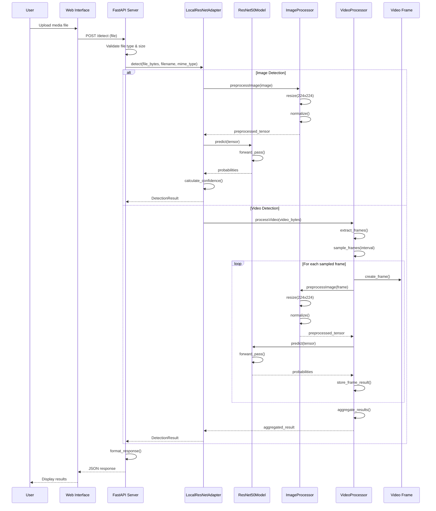
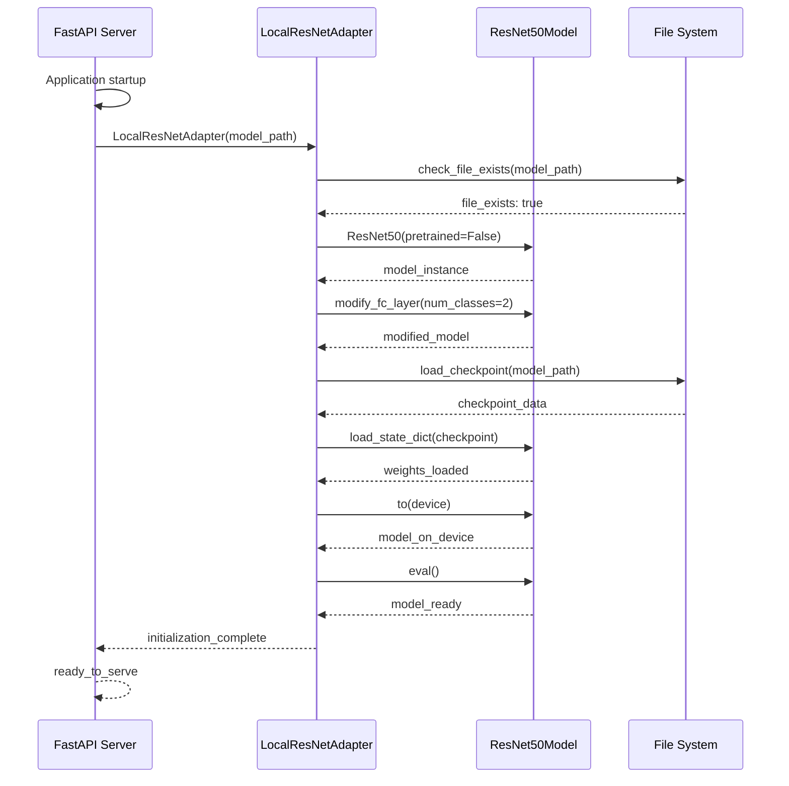
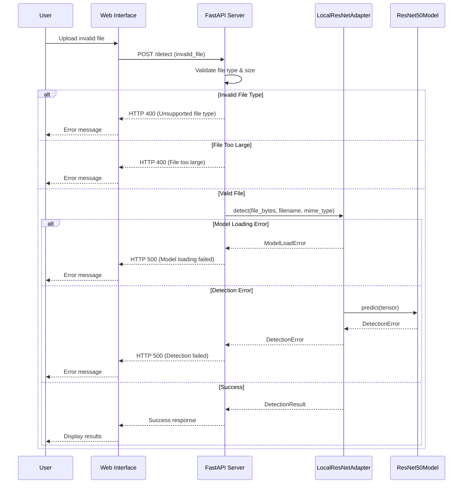
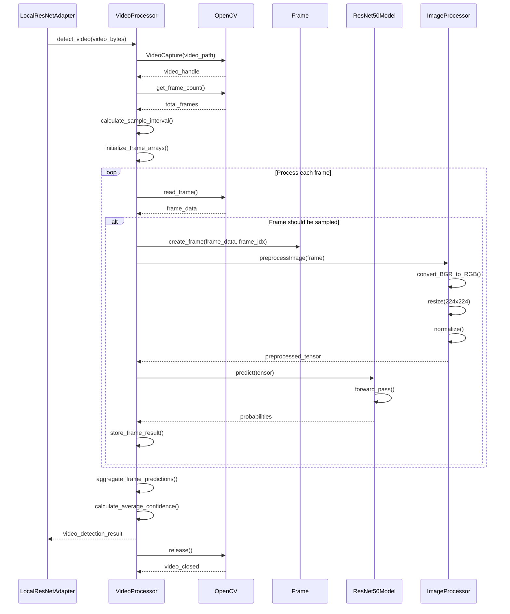

# Deepfake Detection System - Sequence Diagram

## Main Detection Flow

## Model Loading Sequence

## Error Handling Sequence

## Video Processing Detail

## Key Components Description

### Main Detection Flow
- Shows the complete process from user upload to result display
- Handles both image and video detection paths
- Demonstrates the decision flow for different media types

### Model Loading Sequence
- Details the initialization process of the ResNet50 model
- Shows file validation, model creation, and weight loading
- Illustrates the device configuration and model preparation

### Error Handling Sequence
- Covers various error scenarios and their handling
- Shows proper HTTP status codes and error messages
- Demonstrates graceful error recovery

### Video Processing Detail
- Deep dive into video frame processing
- Shows OpenCV integration and frame sampling
- Illustrates the aggregation of multiple frame results

## Processing Characteristics

- **Offline Operation**: All processing happens locally
- **Intelligent Sampling**: Videos are processed using smart frame sampling
- **Error Resilience**: Comprehensive error handling at each step
- **Resource Management**: Proper cleanup of temporary files and resources
- **Scalable Architecture**: Easy to extend for different model types
